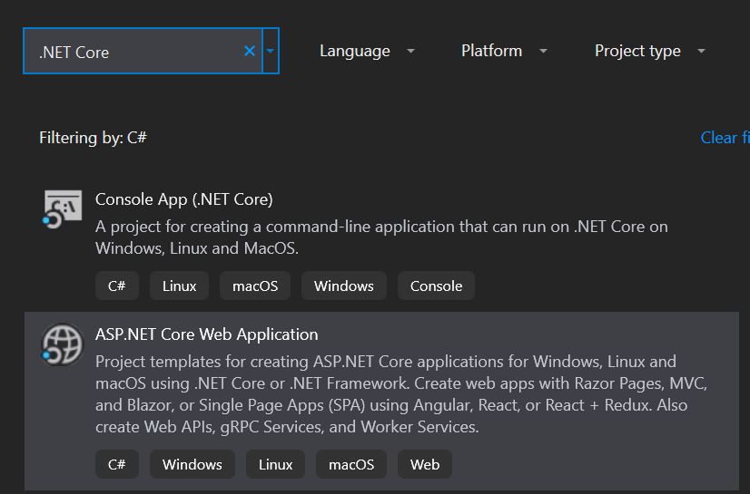
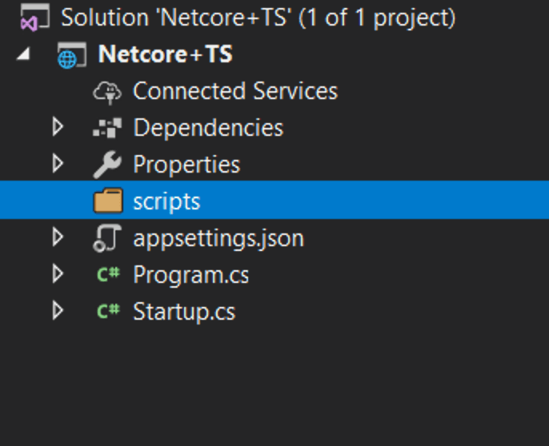

# ASP.NET Core

## Install ASP.NET Core and TypeScript {#install-aspnet-core-and-typescript style="position:relative;"}

First, install [ASP.NET Core](https://dotnet.microsoft.com/apps/aspnet)
if you need it. This quick-start guide requires Visual Studio 2015 or
2017.

Next, if your version of Visual Studio does not already have the latest
TypeScript, you can [install
it](https://www.typescriptlang.org/index.html#download-links).

## Create a new project {#create-a-new-project style="position:relative;"}

1.  Choose **File**
2.  Choose **New Project** (Ctrl + Shift + N)
3.  Search for **.NET Core** in the project search bar
4.  Select **ASP.NET Core Web Application** and press the *Next* button



5.  Name your project and solution. After select the *Create* button


6.  In the last window, select the **Empty** template and press the
    *Create* button


Run the application and make sure that it works.


### Set up the server {#set-up-the-server style="position:relative;"}

Open **Dependencies \> Manage NuGet Packages \> Browse.** Search and
install `Microsoft.AspNetCore.StaticFiles` and
`Microsoft.TypeScript.MSBuild`:


Open up your `Startup.cs` file and edit your `Configure` function to
look like this:

``` {data-language="typescript"}
public void Configure(IApplicationBuilder app, IHostEnvironment env)
{
    if (env.IsDevelopment())
    {
        app.UseDeveloperExceptionPage();
    }

    app.UseDefaultFiles();
    app.UseStaticFiles();
}
```

You may need to restart VS for the red squiggly lines below
`UseDefaultFiles` and `UseStaticFiles` to disappear.

## Add TypeScript {#add-typescript style="position:relative;"}

Next we will add a new folder and call it `scripts`.




## Add TypeScript code {#add-typescript-code style="position:relative;"}

Right click on `scripts` and click **New Item**. Then choose
**TypeScript File** and name the file `app.ts`


### Add example code {#add-example-code style="position:relative;"}

Add the following code to the `app.ts` file.

```ts
function sayHello() {
  const compiler = (document.getElementById("compiler") as HTMLInputElement)
    .value;
  const framework = (document.getElementById("framework") as HTMLInputElement)
    .value;
  return `Hello from ${compiler} and ${framework}!`;
}
```

## Set up the build {#set-up-the-build style="position:relative;"}

*Configure the TypeScript compiler*

First we need to tell TypeScript how to build. Right click on `scripts`
and click **New Item**. Then choose **TypeScript Configuration File**
and use the default name of `tsconfig.json`


Replace the contents of the `tsconfig.json` file with:

``` {tsconfig="true" data-language="typescript"}
{
  "compilerOptions": {
    "noEmitOnError": true,
    "noImplicitAny": true,
    "sourceMap": true,
    "target": "es6"
  },
  "files": ["./app.ts"],
  "compileOnSave": true
}
```

-   [`noEmitOnError`](https://www.typescriptlang.org/tsconfig#noEmitOnError)
    : Do not emit outputs if any errors were reported.
-   [`noImplicitAny`](https://www.typescriptlang.org/tsconfig#noImplicitAny)
    : Raise error on expressions and declarations with an implied `any`
    type.
-   [`sourceMap`](https://www.typescriptlang.org/tsconfig#sourceMap) :
    Generates corresponding `.map` file.
-   [`target`](https://www.typescriptlang.org/tsconfig#target) : Specify
    ECMAScript target version.

Note: `"ESNext"` targets latest supported

[`noImplicitAny`](https://www.typescriptlang.org/tsconfig#noImplicitAny)
is good idea whenever you're writing new code --- you can make sure that
you don't write any untyped code by mistake. `"compileOnSave"` makes it
easy to update your code in a running web app.

#### *Set up NPM* {#set-up-npm style="position:relative;"}

We need to setup NPM so that JavaScript packages can be downloaded.
Right click on the project and select **New Item**. Then choose **NPM
Configuration File** and use the default name of `package.json`.


Inside the `"devDependencies"` section of the `package.json` file, add
*gulp* and *del*

``` {tsconfig="true" data-language="typescript"}
"devDependencies": {
    "gulp": "4.0.2",
    "del": "5.1.0"
}
```

Visual Studio should start installing gulp and del as soon as you save
the file. If not, right-click package.json and then Restore Packages.

After you should see an `npm` folder in your solution explorer


#### *Set up gulp* {#set-up-gulp style="position:relative;"}

Right click on the project and click **New Item**. Then choose
**JavaScript File** and use the name of `gulpfile.js`

```js
/// <binding AfterBuild='default' Clean='clean' />
/*
This file is the main entry point for defining Gulp tasks and using Gulp plugins.
Click here to learn more. http://go.microsoft.com/fwlink/?LinkId=518007
*/

var gulp = require("gulp");
var del = require("del");

var paths = {
  scripts: ["scripts/**/*.js", "scripts/**/*.ts", "scripts/**/*.map"],
};

gulp.task("clean", function () {
  return del(["wwwroot/scripts/**/*"]);
});

gulp.task("default", function (done) {
    gulp.src(paths.scripts).pipe(gulp.dest("wwwroot/scripts"));
    done();
});
```

The first line tells Visual Studio to run the task 'default' after the
build finishes. It will also run the 'clean' task when you ask Visual
Studio to clean the build.

Now right-click on `gulpfile.js` and click Task Runner Explorer.


If 'default' and 'clean' tasks don't show up, refresh the explorer:


## Write a HTML page {#write-a-html-page style="position:relative;"}

Right click on the `wwwroot` folder (if you don't see the folder try
building the project) and add a New Item named `index.html` inside. Use
the following code for `index.html`

``` {data-language="typescript"}
<!DOCTYPE html>
<html>
<head>
    <meta charset="utf-8" />
    <script src="scripts/app.js"></script>
    <title></title>
</head>
<body>
    <div id="message"></div>
    <div>
        Compiler: <input id="compiler" value="TypeScript" onkeyup="document.getElementById('message').innerText = sayHello()" /><br />
        Framework: <input id="framework" value="ASP.NET" onkeyup="document.getElementById('message').innerText = sayHello()" />
    </div>
</body>
</html>
```

## Test {#test style="position:relative;"}

1.  Run the project
2.  As you type on the boxes you should see the message appear/change!


## Debug {#debug style="position:relative;"}

1.  In Edge, press F12 and click the Debugger tab.
2.  Look in the first localhost folder, then scripts/app.ts
3.  Put a breakpoint on the line with return.
4.  Type in the boxes and confirm that the breakpoint hits in TypeScript
    code and that inspection works correctly.


Congrats you've built your own .NET Core project with a TypeScript
frontend.

::: _attribution
© 2012-2023 Microsoft\
Licensed under the Apache License, Version 2.0.\
[https://www.typescriptlang.org/docs/handbook/asp-net-core.html](https://www.typescriptlang.org/docs/handbook/asp-net-core.html){._attribution-link}
:::
